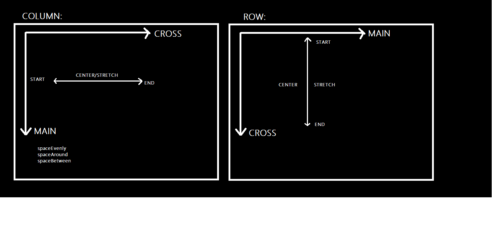
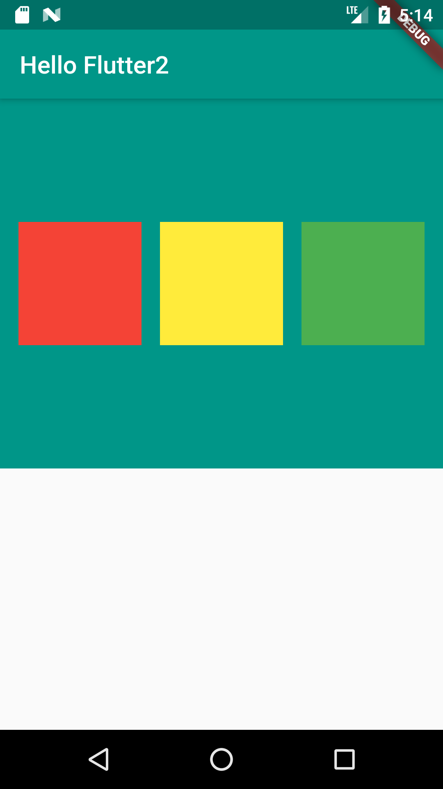

# hello_flutter
 ab ovo ("The beginning")

##  👇🏽👇🏽👇🏽Some Containers() and Text() Properties [decoraton: & style:]
 

## 👇🏽👇🏽👇🏽 Visualising Cross/Main Axis 
 

## 👇🏽👇🏽👇🏽 Cross/Main Axis in Flutter
 

